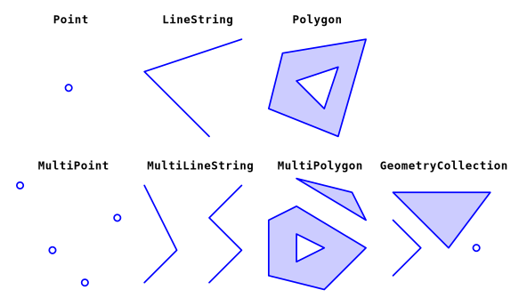

# 🔹 Sesión 2

En esta sesión trabajaremos con la biblioteca `shapely`, que nos permite realizar operaciones geométricas y espaciales en Python. Aprenderemos a crear, manipular y analizar geometrías, así como a realizar operaciones espaciales como la intersección, la unión y la diferencia entre geometrías.

## Introducción

En el capítulo anterior cubrimos los fundamentos de trabajar con Python. Ahora pasaremos al tema principal de este curso: _trabajar con datos geoespaciales_.

Los datos geoespaciales se pueden dividir en dos categorías principales:

- Capas de datos vectoriales
- Capas de datos ráster

En los próximos tres capítulos, abordaremos los fundamentos de trabajar con el primer tipo, las _capas vectoriales_, en Python. En esta sesión cubrimos el paquete `shapely`, que se utiliza para representar y trabajar con _geometrías vectoriales individuales_.

Las _geometrías individuales_ dentro de una capa vectorial se almacenan como geometrías de `shapely`. Así que es importante familiarizarse con este paquete antes de pasar a trabajar con _capas vectoriales_ completas.



Recuperado de: Dorman, M. (2025). _Geometries (Shapely)._ En _Spatial Data Programming with Python._

```{admonition} 쯈ué es una geometría individual?

Una **geometría individual** es una representación única de una forma geométrica, definida según los [tipos establecidos en la especificación *Simple Features*](https://en.wikipedia.org/wiki/Simple_Features). Esta especificación contempla al menos 17 tipos de geometrías, aunque en la práctica se utilizan comúnmente solo 7. Estas son:

- `Point`: un punto en el espacio (bidimensional o tridimensional).
- `LineString`: una línea compuesta por una secuencia de puntos conectados.
- `Polygon`: un área cerrada delimitada por una secuencia de puntos (puede incluir huecos).
- `MultiPoint`: un conjunto de puntos.
- `MultiLineString`: un conjunto de líneas (`LineString`).
- `MultiPolygon`: un conjunto de polígonos.
- `GeometryCollection`: una colección que puede incluir cualquier combinación de los tipos anteriores.
```

Una forma común de representar estas geometrías es mediante el formato **WKT (Well-Known Text)**, un lenguaje de marcado en texto plano que describe el tipo de geometría y sus coordenadas.

Por ejemplo:

| Tipo                   | Ejemplo WKT                                                                                                                |
| ---------------------- | -------------------------------------------------------------------------------------------------------------------------- |
| `'Point'`              | `POINT (30 10)`                                                                                                            |
| `'LineString'`         | `LINESTRING (30 10, 10 30, 40 40)`                                                                                         |
| `'Polygon'`            | `POLYGON ((35 10, 45 45, 15 40, 10 20, 35 10), (20 30, 35 35, 30 20, 20 30))`                                              |
| `'MultiPoint'`         | `MULTIPOINT (10 40, 40 30, 20 20, 30 10)`                                                                                  |
| `'MultiLineString'`    | `MULTILINESTRING ((10 10, 20 20, 10 40), (40 40, 30 30, 40 20, 30 10))`                                                    |
| `'MultiPolygon'`       | `MULTIPOLYGON (((40 40, 20 45, 45 30, 40 40)), ((20 35, 10 30, 10 10, 30 5, 45 20, 20 35), (30 20, 20 15, 20 25, 30 20)))` |
| `'GeometryCollection'` | `GEOMETRYCOLLECTION (POINT (40 10), LINESTRING (10 10, 20 20, 10 40), POLYGON ((40 40, 20 45, 45 30, 40 40)))`             |

> 🛈 **WKT es ampliamente utilizado** en bibliotecas como `shapely` y bases de datos espaciales como PostGIS, pero **no es la única forma** de representar geometrías.

### Otros formatos comunes para representar geometrías:

- **WKB (Well-Known Binary):** versión binaria de WKT, más eficiente para almacenamiento y procesamiento computacional.
- **GeoJSON:** basado en JSON, ideal para aplicaciones web y APIs.
- **Shapefile (.shp):** formato binario tradicional muy usado en software SIG como QGIS.
- **GML / KML:** formatos XML utilizados en entornos interoperables o visualización (como Google Earth).

Cada uno de estos formatos tiene ventajas según el contexto de uso: análisis, visualización, almacenamiento o intercambio entre herramientas.

## Shapely

`shapely` es una biblioteca de Python para trabajar con geometrías vectoriales, es decir, el _componente geométrico_ de las capas vectoriales (el otro componente son los atributos no espaciales).

`shapely` es una interfaz de Python para la biblioteca de geometría `GEOS` (Geometry Engine - Open Source), que es una biblioteca de C++. `GEOS` es la biblioteca de geometría subyacente utilizada por muchos sistemas de información geográfica (SIG) de código abierto y bibliotecas de análisis espacial, como `PostGIS`, `GDAL`, `GeoPandas`, `QGIS`, entre otros.

La [documentación](https://shapely.readthedocs.io/en/stable/manual.html) de `shapely` es muy completa y contiene ejemplos de uso.

## Contenidos de esta sesión

En esta sesión estaremos trabajando con este cuaderno de trabajo:

[](https://colab.research.google.com/github/patymunoz/curso-geoespacial/blob/main/notebooks/sesion2.ipynb)

Al finalizar el taller, tienes disponible un cuaderno para practicar lo aprendido:

[](https://colab.research.google.com/github/patymunoz/curso-geoespacial/blob/main/notebooks/sesion2_practica.ipynb)
