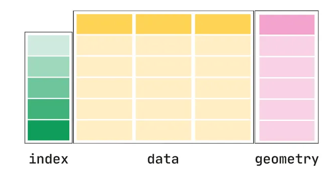
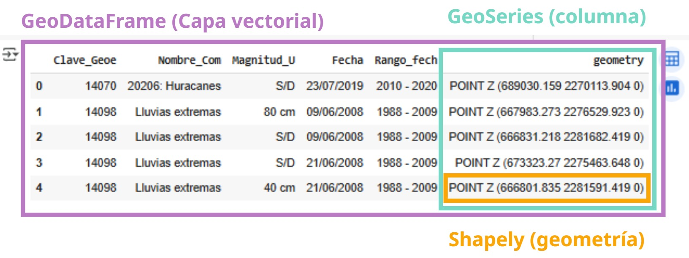

# 🔹 Sesión 3

En esta sesión trabajaremos con la biblioteca `geopandas`, que nos permite trabajar con datos geoespaciales en Python. Aprenderemos a leer, escribir y manipular datos geoespaciales, así como a realizar análisis espaciales y visualizaciones.

## Introducción

En la sesión anterior cubrimos los fundamentos de trabajar con geometrías individuales. Ahora pasaremos al tema principal de este curso: _trabajar con capas vectoriales_.

[Geopandas](http://geopandas.org/) es la biblioteca específica para trabajar con datos geoespaciales en Python. Geopandas combina las capacidades de `pandas` para el manejo de datos tabulares con las capacidades de `shapely` para el manejo de geometrías. Esto nos permite trabajar con datos geoespaciales de manera similar a como lo haríamos con un `DataFrame` de `pandas`.

**Figura 1.** Estructura de un GeoDataFrame (Fuente: [Geopandas](https://geopandas.org/en/stable/getting_started/introduction.html))

Las estrucutras de datos de `geopandas` son:

- `GeoSeries`: una serie de geometrías, similar a una columna de un `DataFrame` de `pandas`.

- `GeoDataFrame`: un `DataFrame` de `pandas` que contiene una columna de geometrías. Es la estructura principal para trabajar con datos geoespaciales en `geopandas`.

**Figura 2.** Estructura de un GeoDataFrame en un entorno de Jupyter Notebook (Fuente: Elaboración propia.)

## Datos

Para esta sesión utilizaremos un conjunto de datos de Información Sociodemográfica por colonia, Jalisco 2020. Colonias INE 2024 (Colonias Enteras) proveniente del [Instituto de Información Estadística y Geográfica de Jalisco (IIEG)](https://iieg.gob.mx/ns/?page_id=881).

Los datos se encuentran en formato `shapefile` y están disponibles para su descarga en el siguiente enlace:

## Contenidos de esta sesión

En esta sesión estaremos trabajando con este cuaderno para trabajar con _GeoPandas_:

También veremos algunos ejemplos para trabajar el **Sistema de Coordenadas de Referencia (CRS)**

Créditos de la visualización: [@jasondavies](https://www.jasondavies.com/)

En este cuaderno trabajaremos con el _CRS_ de datos geoespaciales:

