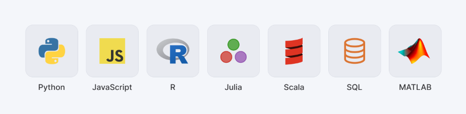

# Fundamentos de Python

## Introducción

En este capítulo, introducimos los conceptos básicos, operadores y estructuras de datos en Python.

Python es un lenguaje de programación, interpretado y de propósito general. Es conocido por su simplicidad y legibilidad. Python es ampliamente utilizado en diversas áreas, incluyendo desarrollo web, análisis de datos, inteligencia artificial y automatización de tareas.



## Variables y asignación

<div style="text-align: center;">
  
</div>

Los conceptos más básicos son los de _variables_ y _asignación_. Asignamos valores a variables para guardar resultados intermedios en la memoria de la computadora y continuar procesándolos de forma incremental a lo largo del _script_. Veremos que las variables pueden almacenar valores de cualquier nivel de complejidad, desde números o cadenas simples, hasta arreglos, tablas, capas vectoriales o rásters.

La asignación en Python se realiza con el operador `=`:

- A la izquierda del `=` se especifica el _nombre_ de la variable
- A la derecha del `=` se indica el _valor_ que se quiere asignar

Por ejemplo, la siguiente línea asigna el valor numérico `3` a una variable llamada `x`:

```python
x = 3
```

Los nombres de variables pueden componerse de letras minúsculas (`[a-z]`), mayúsculas (`[A-Z]`), dígitos (`[0-9]`) y guiones bajos (`_`).  
También ten en cuenta que los nombres de variables **distinguen entre mayúsculas y minúsculas**: por ejemplo, `g` y `G` son dos variables distintas.

Ahora podemos acceder al valor asignado a `x` en cualquier expresión posterior del script:

```python
x
```

    3

Asignar otro valor a una variable ya definida **reemplaza** su contenido anterior.

```python
x = 7
```

    7

Intentar acceder a una variable que **no ha sido definida** es un error común.  
Por ejemplo, si no hemos definido una variable llamada `z` en ninguna parte del script, entonces al usar `z` se lanza un error:

```python
# z  ## Generará un error
```

Como puedes ver, las variables son nombres simbólicos que almacenan valores en memoria.

Podemos verificar si una variable existe (es decir, si está definida) usando la palabra clave `in` en el diccionario que devuelve la función incorporada `globals()`:

```python
'x' in globals()
```

También existe una función llamada `locals()` que devuelve las variables definidas dentro de un ámbito local.

Estas funciones son especialmente útiles al trabajar dentro de `funciones`.

## Funciones

Las funciones son bloques de código con un nombre particular y que realizan una tarea específica.

Las funciones en Python se ejecutan escribiendo su nombre seguido de paréntesis.

Dentro de los paréntesis puede haber cero o más argumentos (entradas de la función), separados por comas:

```python
sort([3, 1, 2])
```

    [1, 2, 3]

Construir una función es una forma de encapsular un bloque de código que puede ser reutilizado en diferentes partes del script. Las funciones pueden recibir argumentos y devolver resultados.

En este curso no profundizaremos en la construcción de funciones, pero te dejo por acá la [documentación oficial de Python](https://docs.python.org/3/tutorial/controlflow.html#defining-functions) para que puedas consultarla.

## Tipos de datos

Los tipos de datos son una parte fundamental de cualquier lenguaje de programación. En Python, los tipos de datos se dividen en dos categorías principales: **atómicos** y **colecciones**.

| Tipo de dato | Significado | Nivel     | Mutabilidad | Ejemplo         |
| ------------ | ----------- | --------- | ----------- | --------------- |
| `int`        | Integer     | átomico   | inmutable   | `7`             |
| `float`      | Float       | átomico   | inmutable   | `3.2`           |
| `bool`       | Boolean     | átomico   | inmutable   | `True`          |
| `None`       | None        | átomico   | inmutable   | `None`          |
| `str`        | String      | colección | inmutable   | `"Hello!"`      |
| `list`       | List        | colección | mutable     | `[1,2,3]`       |
| `tuple`      | Tuple       | colección | inmutable   | `(1,2)`         |
| `dict`       | Dictionary  | colección | mutable     | `{"a":2,"b":7}` |
| `set`        | Set         | colección | mutable     | `{"a","b"}`     |

Recuperado de: Dorman, M. (2025). _Python Basis._ En _Spatial Data Programming with Python._

### Int y float

Los tipos `int` y `float` son los tipos numéricos en Python. Los números enteros (`int`) son números sin decimales, mientras que los números de punto flotante (`float`) son números con decimales.

#### Operadores aritméticos

Los operadores aritméticos son símbolos que indican operaciones matemáticas a realizar con los operandos.

Los operadores aritméticos básicos son:

| Operador | Significado                 |
| -------- | --------------------------- |
| `+`      | Suma                        |
| `-`      | Resta                       |
| `*`      | Multiplicación              |
| `/`      | División                    |
| `**`     | Exponente                   |
| `//`     | división entera hacia abajo |
| `%`      | Módulo                      |

Recuperado de: Dorman, M. (2025). _Python Basis._ En _Spatial Data Programming with Python._

Los operadores están asociados con las reglas de _precedencia_, que son similares y están de acuerdo con el [orden de operaciones](https://en.wikipedia.org/wiki/Order_of_operations) en matemáticas. Por ejemplo, como era de esperar, `*` tiene precedencia sobre `+`, por lo tanto:

```python
3 + 4 * 5
```

    23

Los cálculos pueden ser _asignados_ a `variables` para mantener el resultado intermedio en memoria, en caso de que nuestro cálculo requiera varios pasos. Usando el operador de asignación y los operadores aritméticos, ya sabemos cómo escribir código Python que comprende varias expresiones. Por ejemplo:

```python
x = 3
y = 4
z = x + y * 9
```

    39

#### Asignación incremental

La asignación incremental es una forma de asignar un nuevo valor a una variable, sumando o restando un valor específico al valor actual de la variable.

Por ejemplo, si tenemos una variable `x` con un valor inicial de `3`, podemos incrementar su valor en `2` de la siguiente manera:

```python
x = 3
x += 2
x
```

    5

```{admonition} Ejemplo
Python también permite la asignación decremental (`-=`), la asignación multiplicativa (`*=`) y la asignación de división (`/=`).
```

### Booleanos

Los valores booleanos son un tipo de dato que solo puede tener dos valores: `True` o `False`. Estos valores son útiles para realizar comparaciones y tomar decisiones en el código.

#### Operadores lógicos

Los operadores lógicos son símbolos que se utilizan para combinar o invertir valores booleanos. Los operadores lógicos más comunes son:

| Operador | Significado |
| -------- | ----------- |
| `and`    | Y           |
| `or`     | O           |
| `not`    | No          |

Recuperado de: Dorman, M. (2025). _Python Basis._ En _Spatial Data Programming with Python._

#### Operadores de comparación

Los operadores de comparación son símbolos que se utilizan para comparar dos valores y devolver un valor booleano (`True` o `False`). Los operadores de comparación más comunes son:

| Operador | Significado       |
| -------- | ----------------- |
| `==`     | Igual             |
| `!=`     | No igual          |
| `<`      | Menor que         |
| `<=`     | Menor o igual que |
| `>`      | Mayor que         |
| `>=`     | Mayor o igual que |

Recuperado de: Dorman, M. (2025). _Python Basis._ En _Spatial Data Programming with Python._

### None

El tipo `None` es un tipo especial en Python que representa la ausencia de valor o un valor nulo. Se utiliza comúnmente para indicar que una variable no tiene un valor asignado o que una función no devuelve nada.

### Cádenas de texto _(strings)_

Las cadenas de texto (`str`) son secuencias de caracteres. Se pueden definir utilizando comillas simples (`'`) o dobles (`"`). Las cadenas son inmutables, lo que significa que no se pueden modificar una vez creadas.

### Listas

Las listas (`list`) son colecciones ordenadas y mutables de elementos. Pueden contener elementos de diferentes tipos, incluyendo otros tipos de colecciones. Las listas se definen utilizando corchetes (`[]`).

```python
mi_lista = [1, 2, 3, "Hola", True]
```

Las listas son mutables, lo que significa que puedes agregar, eliminar o modificar elementos después de haberlas creado.

- Crear una lista vacía
- Acceder a los elementos de una lista
- Modificar elementos de una lista
- Agregar elementos a una lista
- Eliminar elementos de una lista
- Slice de listas
- Operadores de listas (+, \*)

### Tuplas

Las tuplas (`tuple`) son colecciones ordenadas e inmutables de elementos. Se definen utilizando paréntesis (`()`). Al igual que las listas, pueden contener elementos de diferentes tipos.

```python
mi_tupla = (1, 2, 3, "Hola", True)
```

Las tuplas son inmutables, lo que significa que no se pueden modificar una vez creadas. Sin embargo, puedes acceder a sus elementos de la misma manera que lo harías con una lista.

### Diccionarios

Los diccionarios (`dict`) son colecciones desordenadas y mutables de pares clave-valor. Se definen utilizando llaves (`{}`) y los pares clave-valor se separan con comas. Las claves deben ser únicas y pueden ser de cualquier tipo inmutable, como cadenas, números o tuplas.

```python
mi_diccionario = {
    "nombre": "Hannia",
    "edad": 30,
    "ciudad": "Madrid"
}
```

- Acceder a los elementos de un diccionario
- Modificar elementos de un diccionario
- Agregar elementos a un diccionario
- Eliminar elementos de un diccionario

### Sets

Los conjuntos (`set`) son colecciones desordenadas y mutables de elementos únicos. Se definen utilizando llaves (`{}`) o la función `set()`. Los conjuntos son útiles para realizar operaciones matemáticas como uniones, intersecciones y diferencias.

```python
mi_set = {1, 2, 3, 4, 5}
```

```{admonition} Mutaciones y copias de código
:class: note

En Python, las colecciones mutables (como listas y diccionarios) pueden cambiar después de su creación.
Cuando asignas una colección a otra variable (`b = a`), ambas apuntan al mismo objeto en memoria: cambiar `b` también cambia `a`.
Para evitarlo y trabajar con una copia independiente, usa métodos como `b = a.copy()`.
```
